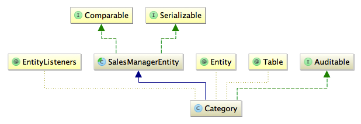

#数据访问层和事务管理

##DAO

CategroyDaoImpl相关类图


* SalesManagerEntityDao

泛型接口，定义了getEntityManager()，get，list，save，update等基本操作方法。

* SalesManagerJpaDaoSupport

最重要地方是定义了entityManager成员，通过@PersistenceContext注解注入。SalesManagerEntityDao接口所对应的真正实现都基于entityManager。

* SalesManagerEntityDaoImpl

抽象类，继承了SalesManagerJpaDaoSupport，所有DAO实现类的父类。

* CategoryDao

Category DAO的操作接口定义

* CategoryDaoImpl

Category DAO的具体实现，集成了Querydsl。

最好看看spring-context.xml中相关定义：

```
	<bean id="entityManagerFactory" class="org.springframework.orm.jpa.LocalContainerEntityManagerFactoryBean">
		<property name="persistenceUnitName" value="sm-unit" />
		<property name="dataSource" ref="datasource" />
		<property name="persistenceXmlLocation" value="classpath:META-INF/sm-persistence.xml" />
		
		<property name="jpaVendorAdapter">
			<bean class="org.springframework.orm.jpa.vendor.HibernateJpaVendorAdapter">
				<property name="showSql" value="true" />
				<property name="generateDdl" value="false" />
				<property name="databasePlatform" value="${hibernate.dialect}" />
			</bean>
		</property>
		<property name="jpaProperties">
			<util:map>
				<entry key="hibernate.default_schema" value="${db.schema}" />
				<entry key="hibernate.hbm2ddl.auto" value="${hibernate.hbm2ddl.auto}" />
				<entry key="hibernate.show_sql" value="true" />
				<entry key="hibernate.cache.provider_class" value="org.hibernate.cache.EhCacheProvider" />
				<entry key="hibernate.cache.use_second_level_cache" value="true" />
			</util:map>
		</property>

		<property name="loadTimeWeaver">
			<bean class="org.springframework.instrument.classloading.InstrumentationLoadTimeWeaver" />
		</property>
	</bean>

	<bean class="org.springframework.orm.jpa.support.PersistenceAnnotationBeanPostProcessor" />
```
使用Hibernate做JPA Provider，二级缓存也启用了。（在Entity中，没有使用Hibernate cache相关的注解。二级缓存并不会真正使用？？）

##Entity



* SalesManagerEntity

所有Entity的超类，定义了isNew()，equals()和hashCode()方法，都是基于ID。所有实体的ID都是使用sequence生成，相同类型的Entity，ID不会重复。

* AuditSection

AuditSection是@Embeddable对象，用来记录更改时间。

* Auditable

Auditable接口定义了AuditSection的getter和setter。

* AuditListener

onSaveOrUpdate()上使用了@PrePersist和@PreUpdate注解。Entity上面使用@EntityListeners注解指定AuditListener类作为Entity Listener。当entityManager保存或更新Entity的时候，会先调用onSaveOrUpdate()方法修改AuditSection，从而把更改时间记录下来。

##事务管理

事务管理放在service层，使用Spring AOP声明式事务管理。来看看spring-context.xml中的声明：

```
<tx:annotation-driven />
	<bean id="transactionManager" class="org.springframework.orm.jpa.JpaTransactionManager"
		p:entityManagerFactory-ref="entityManagerFactory">
	</bean>

 	<aop:config>
		<aop:pointcut id="txPointCutDef" expression="this(com.salesmanager.core.business.generic.service.TransactionalAspectAwareService)" />
		<aop:advisor advice-ref="txAdvice" pointcut-ref="txPointCutDef" />
	</aop:config>

	<tx:advice id="txAdvice" transaction-manager="transactionManager">
		<tx:attributes>
			<tx:method name="get*" read-only="true" />
			<tx:method name="list*" read-only="true" />
			<tx:method name="search*" read-only="true" />
			<tx:method name="*" read-only="false" rollback-for="com.salesmanager.core.business.generic.exception.ServiceException" />
		</tx:attributes>
	</tx:advice> 

	<!-- traduction des exceptions -->
	<bean class="org.springframework.dao.annotation.PersistenceExceptionTranslationPostProcessor" />
```
Point Cut - 当前对象是TransactionalAspectAwareService类型

Advice - 根据方法名称判断，查询方法read-only设置为true。其余方法使用事务隔离级别默认设置，当方法抛出ServiceException时，回滚事务。

在service中，捕获到异常，都会重新抛出ServiceException。

Service相关类的类图，以CategoryService为例：


* TransactionalAspectAwareService

TransactionalAspectAwareService只是标记接口，Spring事务管理器用来识别AOP Point Cut。

* SalesManagerEntityService

所有Service的顶级接口，定义了create，update，save等操作。

* SalesManagerEntityServiceImpl

实现了SalesManagerEntityService

* CategoryService

定义了Category Service的所有操作

* CategoryServiceImpl

Category Service的具体实现